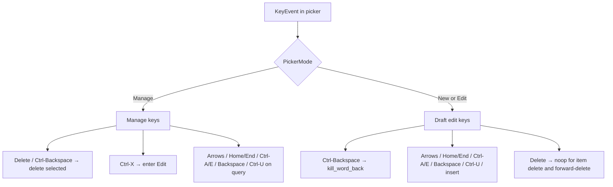

# Design: mid-cursor text editing for Picker drafts

## Architecture

Introduce a small owned buffer type (name: `TextField`) in a new module or beside [`input.rs`](aloggrep-tui/src/input.rs):

```text
TextField { text: String, cursor: usize }  // cursor = char index (UTF-8 safe)
```

Operations: `insert`, `backspace`, `move_left`/`move_right`, `home`/`end`, `kill_to_start` (Ctrl-U), `kill_word_back` (New/Edit Ctrl-Backspace). Char-index cursor; display-width viewport separately in UI.

Wire-in:

| Surface | Storage today | Change |
|---------|---------------|--------|
| Manage filter | `PickerSession.query: String` | `TextField` (or `String` + cursor kept in sync) |
| Highlight New/Edit | `PickerSession.draft` | same |
| MsgChip | `PickerSession.draft` | same |
| Filter/Exclude | `InputBox.draft: String` | `draft: TextField` (or embed cursor on InputBox) |
| Legacy HighlightBox / Input modal | `draft: String` | same API |

Prefer one `TextField` type reused everywhere over parallel cursor fields.

## Key routing



- Manage: remove `Ctrl-E` / `Ctrl-D` action handlers; add `Ctrl-X`, `KeyCode::Delete`, Ctrl+Backspace → existing delete-confirm path.
- Crossterm: Ctrl+Backspace often arrives as `KeyCode::Backspace` + `CONTROL` (verify in tests / manual).
- Up/Down/Tab/Enter Manage 语义不变。

## Rendering

[`render_picker_search_line`](aloggrep-tui/src/ui.rs) / `input_content_spans` / Highlight modal:

1. Split `text` at `cursor` into `before` | `caret_bar()` | `after`.
2. If display width of prompt prefix + full text exceeds area width, choose a window start such that caret stays inside the visible slice (follow caret; when caret at end ≡ pin end).
3. Width: use Unicode display width (add `unicode-width` dependency, or use the helper ratatui already pulls transitively if acceptable to the crate graph).

## InputBox cascade

`InputBox::backspace` when `TextField` is empty and `cursor == 0`: keep cascade `draft_field → pop chip`. Mid-string backspace only deletes a char.

## Compatibility

- Prefill Edit: cursor at end after `enter_edit` / `enter_edit_input`.
- Auto Manage→New on unmatched query: preserve text, cursor at end.
- Tab completion that replaces last token: reset cursor to end of new draft (current behavior after replace).

## Trade-offs

- Char-index (not grapheme cluster): simpler; sufficient for log tags/regex ASCII+CJK; document as known limit.
- Manage Ctrl-Backspace never kills query words: stable delete-item semantics (grilling 方案 3).
- No forward-delete: Backspace + mid cursor covers the stated pain.

## Rollback

Revert `TextField` wiring and key remaps; no data format / config migration.
