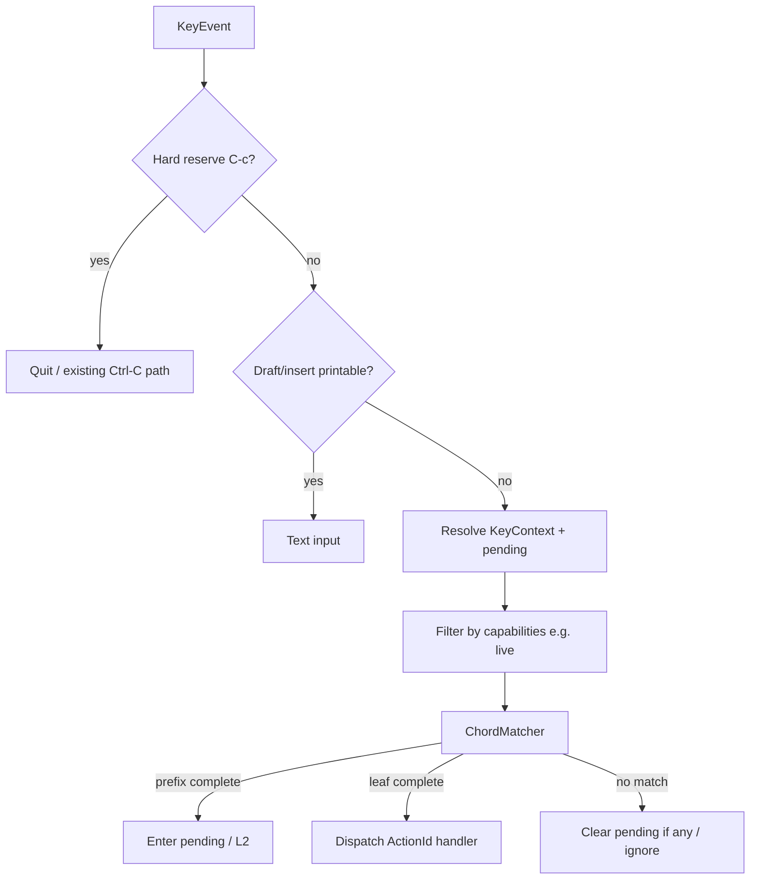

# Design: TUI customizable keymap

## Boundaries

| In | Out |
|----|-----|
| Keyboard action registry + `keymap.toml` | Mouse / scroll bindings |
| Startup load + deep merge | Hot-reload |
| Help / status key strings from store | CLI `grep` keymap |
| `--init` → `config.toml` + `keymap.toml` | Generating `theme.toml` |

## Module layout

New module `alnav/src/keymap.rs` (split internally with `mod` if large):

| Piece | Responsibility |
|-------|----------------|
| `ActionId` | Stable enum / id for every keyboard action |
| `KeyContext` | Maps to Help contexts (`LogList`, `Leader`, `Picker`, …) + `Global` |
| `KeyStroke` | Normalized key: code + ctrl/shift/alt |
| `Binding` | `Vec<KeyStroke>` (len 1 = single; len>1 = chord) |
| `ActionMeta` | context, default binding, `Kind::Prefix \| Leaf`, label, detail, capabilities, handler id |
| `KeymapRegistry` | Compile-time / static registration of all actions (authority) |
| `KeymapStore` | Effective map after merge; lookup + format for UI |
| `parse_stroke` / `parse_binding` | DSL: `"C-s"`, `"S-j"`, `"Space"`; TOML string vs array |
| `merge_user_toml` | Deep-merge + layered errors |
| `serialize_default_toml` | English-commented template for `--init` |
| `ChordMatcher` | Prefix tree over active context bindings; pending stroke buffer |

Wire into:

- `config.rs` — load `keymap.toml` alongside config/theme; surface load status / warnings
- `app.rs` — hold `KeymapStore` (or `Arc`); expose helpers for help
- `main.rs` — replace hard-coded `KeyCode` branches with store-driven dispatch; `--init` / `--force` CLI flags; hard-reserve `C-c` before dispatch
- `help.rs` — build L1/L2/catalog from store + registry labels (drop `'static` key literals)
- `ui.rs` — status hint rendering unchanged at call site; data from help/keymap

## Data contracts

### User keymap.toml (illustrative)

```toml
# Overrides only — missing actions keep builtins.

[log_list]
move_down = "j"
move_up = "k"
bookmark_add = ["m", "a"]
open_leader = "Space"
time_set = ["t", "s"]
# unbind example:
# yank_msg = ""

[leader]
manage_unified = "Space"

[picker]
# ...
```

### Internal effective entry

```text
ActionId + KeyContext → Option<Binding>  # None = unbound
Binding → Kind (Prefix|Leaf) from registry meta (kind is not user-overridable)
```

### Load status (mirror config/theme pattern)

- `Builtin` — no file
- `Loaded` — merged OK (may include soft warnings for unknown keys)
- `Fallback { error }` — parse/type/conflict → defaults

Soft warnings (unknown action/section) do not force Fallback; surface via status flash once at startup (or combine with existing config status).

## Dispatch flow



- Pending prefix state remains on `App` (or moves next to matcher); Esc behavior stays product-defined per context, but Esc binding itself is looked up when it is an action.
- Focus number keys `1`–`5`, operators, Leader, strip `d` chords, etc. all become registered actions.

## Help / status

- Replace `HintEntry { key: &'static str, ... }` with owned/formatted key from `KeymapStore::display(action)` (and optional aggregate groups declared in registry for `j/k` style).
- Catalog sections iterate registry actions for contexts allowed by current capabilities.
- Live: omit file-only actions entirely from Active and full catalog.

## `--init`

- Clap on TUI CLI: `--init`, `--force`.
- Resolve config dir; `create_dir_all`.
- Write `config.toml` from current `AppConfig` defaults + English comments (static template string OK if kept in sync with `AppConfig` fields via test).
- Write `keymap.toml` via `serialize_default_toml()` from registry.
- Skip existing files unless `--force`; print create/skip/overwrite lines to stdout; exit 0.

## Compatibility

- Default registry bindings must match today's hard-coded map (golden test: enumerate expected strokes per ActionId).
- Theme / logcolor unchanged.
- Config load failure messaging style aligned with `CONFIG 回退` / soft `KEYMAP …`.

## Tradeoffs

| Choice | Why |
|--------|-----|
| Registry authority vs embedded TOML | Prevents drift; `--init` always fresh |
| String vs array for single/chord | Avoids alias/chord ambiguity |
| Whole-table fallback on hard conflicts | Safer than half-broken chord trees |
| No mouse in v1 | Keeps DSL keyboard-only |
| Capability filter vs duplicate live section | Less duplication |

## Risks

- Large `main.rs` key-handling rewrite → stage behind registry + matcher with parity tests first.
- Help currently uses `'static` slices → needs owned strings / small cache per frame OK.
- `M-` (Alt) rarely used today; parser accepts it, dispatch must read Alt from `KeyEvent`.
