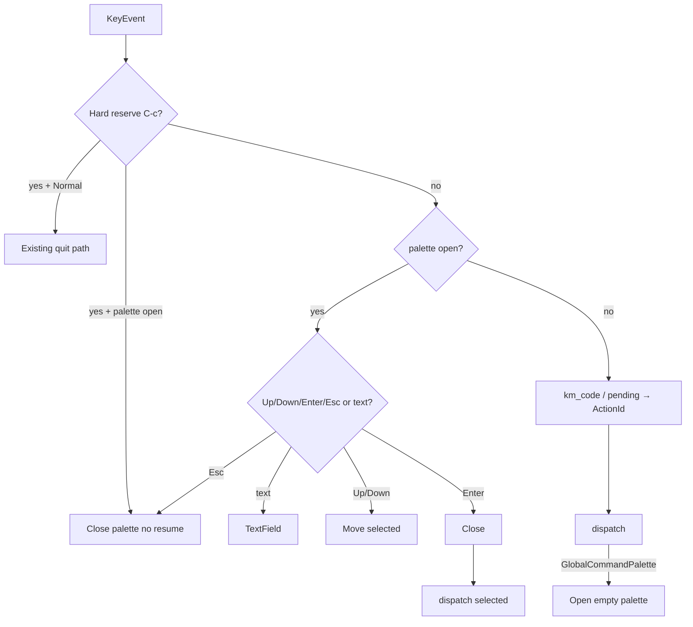

# Design: TUI command palette + ActionStore

## Architecture

Split “what an action is / does” from “which key fires it”.

```
action.rs
  ActionId, ActionMeta (+ palette fields), ActionKind, Capability, KeyContext
  ActionStore::catalog(app) -> Vec<PaletteItem>
  ActionStore::when(app, id) -> bool
  dispatch(app, ActionId)     // match → existing App methods / moved bodies

keymap.rs
  KeyStroke, Binding, KeymapStore, load/merge, matches_*, display, --init serialize
  (re-export ActionId / KeyContext so current `keymap::ActionId` call sites can migrate gradually)

command_palette.rs
  CommandPalette { query: TextField, selected: usize }
  filtered_ids(app, query) via fuzzy_label_indices on palette_title

main.rs
  resolve key → ActionId (existing km_code / pending trees)
  then dispatch(app, id)
  if app.command_palette.is_some() → handle_palette_key (draft + Up/Down/Enter/Esc)

ui.rs
  render_command_palette: top_modal_rect(input) [+ stack_below_rect_gapped(list)]
```



## Module layout

| Piece | Responsibility |
|-------|----------------|
| `action.rs` | Move `ActionId` / `ActionMeta` / `KeyContext` / `Capability` / `ActionKind` out of `keymap.rs`. Add `in_palette`, `palette_title`, `palette_icon` (`&'static str` theme glyph), `when`. `dispatch`. |
| `keymap.rs` | Bindings only. `ActionMeta.default` / toml_key / context stay on meta because `--init` still walks the registry; keymap reads them, does not own handler bodies. |
| `command_palette.rs` | Session state + filter/scroll helpers. No paint, no dispatch. |
| `ui.rs` | Paint only. Reuse modal shell + candidate styles. New `theme::GLYPH_TITLE_PALETTE`. |
| `help.rs` | `ContextKind::CommandPalette`; LogList L1/catalog entry for open; `help_available` false when palette open; status L2 while open. |
| `app.rs` | `command_palette: Option<CommandPalette>`; `open_command_palette` / `close_command_palette`. |
| `main.rs` | Chord resolution stays; bodies move to `dispatch`. Palette key handler. |
| `theme.rs` | Palette title glyph; optional `palette_keyhint_style` (muted, right-aligned). No `Color::*` in `ui.rs`. |

If moving the `ActionId` enum in one diff is too noisy, keep the types in `keymap.rs` for the first commit and put `dispatch` + `catalog`/`when` in `action.rs` that depends on `keymap`. Prefer the split; do not leave handler bodies in `main.rs`.

## Data contracts

### `ActionMeta` additions

```text
in_palette: bool
palette_title: &'static str   // English; unused if !in_palette
palette_icon: &'static str    // theme::GLYPH_* ; unused if !in_palette
```

`label` / `detail` unchanged (Help / status).

### `PaletteItem`

```text
id: ActionId
title: &'static str
icon: &'static str
key_hint: String            // KeymapStore::display(id) or ""
```

### `when(app, id)`

Always AND with `ActionMeta::allowed(file_mode)`. Extra predicates:

| ActionId | Extra `when` |
|----------|----------------|
| `LogListDetailFields`, `LogListDetailPretty`, `LockPid`, `LockTid`, `BookmarkAdd`, `LogListYankMsgLine` / message yank | current visible row exists |
| `LockPid` | row.pid non-empty |
| `LockTid` | row.tid non-empty |
| `BookmarkRemove` | current row is bookmarked |
| `TimeSet` | file mode **and** date candidates exist (same gate as `ts` flash) |
| `TimeClear` | file mode **and** `time_bound.is_some()` |
| `LogListClearLive` | live (`Capability::LiveOnly` is enough) |
| `LogListResumeFollow` | `following == false` |
| `LockClear` | any lock or view-focus active |
| `StripDDelete`, `StripDDisable` | focus is that strip **and** a group is selected |
| others in catalog | always (after capability) |

### Catalog (v1 `in_palette = true`)

| ActionId | `palette_title` | Icon |
|----------|-----------------|------|
| `GlobalFilterNew` | Add Filter | `GLYPH_TITLE_FILTER` |
| `GlobalHighlightNew` | Add Highlight | `GLYPH_TITLE_HIGHLIGHT` |
| `GlobalExcludeNew` | Add Exclude | `GLYPH_TITLE_EXCLUDE` |
| `GlobalOpenHelp` | Open Help | `GLYPH_HELP` |
| `GlobalQuit` | Quit | new or reuse a door/sign-out glyph in `theme.rs` |
| `LogListWrapToggle` | Toggle Wrap | existing wrap-related or `GLYPH_TITLE_LOG` |
| `LogListDetailFields` | Show Fields | `GLYPH_VIEW_FOCUS` |
| `LogListDetailPretty` | Show Pretty | `GLYPH_VIEW_FOCUS` |
| `LogListClearLive` | Clear Live Buffer | `GLYPH_DISCONNECT` |
| `LogListResumeFollow` | Resume Following | `GLYPH_FOLLOWING` |
| `LeaderManage` | Manage Filters | `GLYPH_MODE_MANAGE` |
| `LeaderPresetSave` | Save Preset | `GLYPH_MODE_NEW` |
| `LeaderPresetOpen` | Open Preset | `GLYPH_SOURCE_DIR` |
| `LeaderSummary` | Show Summary | `GLYPH_TITLE_DASHBOARD` |
| `OpenFile` | Open File | `GLYPH_SOURCE_OPEN_FILE` |
| `OpenStream` | Open Stream | `GLYPH_SOURCE_HDC` |
| `TimeSet` | Set Time Window | `GLYPH_TIME` |
| `TimeClear` | Clear Time Window | `GLYPH_TIME` |
| `LockPid` | Lock PID | `GLYPH_LOCK` |
| `LockTid` | Lock TID | `GLYPH_LOCK` |
| `LockViewHighlight` | View Focus Highlight | `GLYPH_VIEW_FOCUS` |
| `LockViewSevere` | View Focus Severe | `GLYPH_CRASH` |
| `LockClear` | Clear Lock | `GLYPH_LOCK` |
| `BookmarkAdd` | Add Bookmark | `GLYPH_BOOKMARK` |
| `BookmarkRemove` | Remove Bookmark | `GLYPH_BOOKMARK` |
| `BookmarkManage` | Manage Bookmarks | `GLYPH_BOOKMARK` |
| `YankCli` | Yank CLI | `GLYPH_TITLE_LOG` |
| `LogListYankMsgLine` | Yank Message | `GLYPH_FIELD_MSG` |
| `StripDDelete` | Delete Selected Group | `GLYPH_TITLE_EXCLUDE` |
| `StripDDisable` | Toggle Selected Group | `GLYPH_ACTION_TOGGLE_OFF` |

Palette chrome (not in catalog): `GlobalCommandPalette` default `C-p`; `PaletteSubmit` Enter; `PaletteUp`/`PaletteDown` Up/Down; `PaletteClose` Esc. Draft printables are **not** keymap actions (same as Picker).

### Filter / layout

- `catalog(app)` → titles → `fuzzy_label_indices` if query non-empty; empty query → **no list** (do not use the empty-query “first N” path of `fuzzy_label_indices`).
- Visible window 10 rows; `selected` clamped; ViewportPaint: only paint visible candidate rows (fuzzy-matching.md).
- Width: `min(72, max(40, frame.width * 60 / 100))`.
- Zero matches: one dim row, `selected` ignored, Enter no-op.
- Right key hint uses `theme::muted()`; truncate title with existing `fit_label` before the hint.

### Dispatch

```rust
pub fn dispatch(app: &mut App, id: ActionId)
```

`handle_normal_key` currently ignores `InputBox` (`_input`). Live clear already goes through `try_handle_ctrl_l(app)`. Do not invent `Box<dyn Fn>`. Insert / Picker / TimePanel draft paths stay text-input bypasses; they are not `dispatch` of printables.

Open palette:

```text
clear pending_* + pending_leader
following = false
command_palette = Some(CommandPalette::new())
```

Enter:

```text
id = filtered[selected]
close_command_palette()  // no resume_following
dispatch(app, id)
```

## Compatibility

- Default keybindings other than new `C-p` / palette internals unchanged.
- Help short labels unchanged.
- Idle status two-hint contract (08-13) unchanged.
- `--init` grows new keys; missing user keys → builtin.
- File/live `Capability` filtering for Help catalog unchanged; palette `when` is stricter (row/strip).

## Trade-offs

- Moving `ActionId` out of `keymap.rs` is a large import churn; worth it so Keymap cannot keep growing handler metadata.
- Empty query does not browse the catalog; discovery is via Help `?` and typing. Accepted in grill.
- `j`/`k` in the palette type rather than move, unlike LogList. Matches Picker; required so `Bookmark` is typeable.

## Rollback

Revert `action.rs` / `command_palette.rs`, restore `handle_*` bodies in `main.rs`, drop `App.command_palette`. No data migration. User `keymap.toml` without new keys is already valid.
