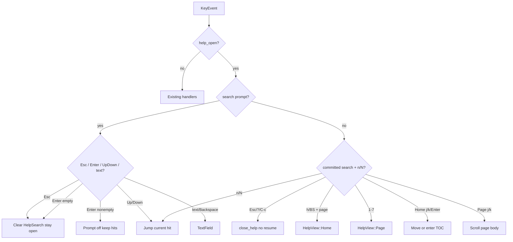

# Design: TUI help panel pages and search

## Architecture

Keep Help a read-only modal. Replace the single `help_scroll` document with an explicit view + optional search session. `help.rs` remains the only copy source (contracts, keys, TOC labels). `ui.rs` only lays out and paints. `handle_help_key` owns routing; it still does not `dispatch` LogList actions.

```
help.rs
  HelpPage, HelpView, HelpSearch, HelpHit
  home_lines / page_lines / search_corpus
  hint tables remapped from catalog_entries → seven pages
  ≤5-line PAGE_BLURB[HelpPage]

app.rs
  help_open: bool
  help_view: HelpView          // Home { toc, toc_off } | Page { id, scroll }
  help_search: Option<HelpSearch>

main.rs
  handle_help_key: close vs back vs toc vs page scroll vs search prompt

ui.rs
  render_help_panel: pin Active+chrome on Home; body + optional query bar
  theme::help_search_hit_style / help_search_current_style (wrap existing tokens)
```



## State

```text
enum HelpPage { Filter, Exclude, Highlight, Log, Session, Picker, Overlays }  // 1..=7

enum HelpView {
  Home { toc: u8 /* 0..6 */, toc_off: usize },
  Page { id: HelpPage, scroll: usize },
}

struct HelpHit { page: Option<HelpPage>, /* None = Home */ line: usize, start: usize, end: usize }

struct HelpSearch {
  query: TextField,
  prompt: bool,          // vim prompt focused
  hits: Vec<HelpHit>,
  current: usize,
}
```

- `open_help()`: `help_open = true`, `help_search = None`, `HelpView::Home { toc: preselect(focus), toc_off: 0 }`.
- `close_help()`: flags false / `None`; still must **not** `resume_following`.
- `help_pop_to_home()`: only from `Page`; sets Home with `toc` = that page’s index; does not close.
- Two scroll offsets (TOC vs page) so returning Home does not inherit a page body offset.

`Focus` → TOC index: ChipStrip=0, ExcludeStrip=1, HighlightStrip=2, LogList=3. Else 0 (Filter) only if we lack a mapping — **no**: grill said LogList→Log, strips→matching page. Unmapped focus cannot open Help (`help_available` already restricts to those four).

## Home chrome vs page body

| Region | Home | Page |
|--------|------|------|
| Top | Active title + ≤4 `detail_line`s | Page title + blurb (≤5) |
| Mid | TOC 7 rows, selected uses existing candidate/selection token (not a new accent) | Key table for that page |
| Bottom | Chrome hints | Same chrome; `h back` is live |
| Scroll | TOC only; Active+chrome pinned | Body; chrome pinned if height allows, else body takes remaining |

Short-frame rule (Home): `inner.height` minus Active block minus 1 chrome row is the TOC viewport. `toc_off` follows the selected row (same idea as `list_offset`).

## Page blurbs (authoritative copy, ≤5 lines)

Implement these strings in `help.rs`. Do not paraphrase in `ui.rs`.

**Filter.** Filter chips live in groups. Inside a group every chip is AND; across enabled groups the result is OR. If every group is disabled, that is the same as an empty list: every row stays visible. New filters go through the Picker, not the old Input strip. Startup CLI flags become group 0 and can be deleted or disabled like any other group.

**Exclude.** Exclude groups apply as global AND NOT after Filter (then lock and the time window). They are not an inverted Filter page: a row must pass Filter and then match no enabled Exclude. Empty Exclude strip is folded. `C` plus a field letter pushes an exclude from the current row.

**Highlight.** Highlight groups paint matching text; they do not hide rows. Enabled patterns are OR and walk the 8-slot color ramp in order. `/` on LogList opens Highlight New; `/` inside this Help panel is search (Help context) and does not create a highlight.

**Log.** The log list is the action origin: most cancels return here. Leaving the last visible row pauses following; landing on the last row resumes it; Esc still resumes explicitly. Yank, wrap, visual, and chip-from-row start on the current line. File mode can browse the whole file; live mode is a dropping ring.

**Session.** Lock PID and lock TID are mutually exclusive and AND after chips. The global time window is file-only and orthogonal to Filter groups. Bookmarks are session-only, anchored by `row_id`, and vanish when the process exits. Follow and device/file state live in the status bar, not in a chip group.

**Picker.** Space is Leader; Space Space opens unified Manage. Bare `;` `/` `` ` `` force New for Filter / Highlight / Exclude. Typing in Manage with no matches switches to New; Esc always closes the panel and does not return to Manage. Bookmark Manage is `mm`, not this unified picker.

**Overlays.** Fields (`p`) and Pretty (`P`) are a top modal on the current row; Esc closes the overlay only and does not resume following. Pretty pretty-prints JSON in msg (then raw). The command palette (`C-p`) is not a Picker: an empty query shows no list. This Help panel’s own keys are on the Home footer, not in this list.

## Key tables per page

Remap `catalog_entries` (do not keep a parallel “All commands” dump). Split the old Operators / Leader buckets:

| Page | Hint sources (existing `ActionId`s / literals) |
|------|--------------------------------------------------|
| Filter | `GlobalFilterNew`; strip h/l + `dd`/`di`; `LogListChip` (row→filter) |
| Exclude | `GlobalExcludeNew`; `LogListExcludeChip`; strip h/l + `dd`/`di` |
| Highlight | `GlobalHighlightNew`; `LogListNextMatch`/`PrevMatch`; strip h/l + `dd`/`di` |
| Log | Former Navigation (move/jump/gG/follow/severe/`1-5`); wrap; visual; yank family already in overlays? **Yank stays on Log** (action origin). Chip-from-row `c` also on Log. |
| Session | Former Session (presets, source, lock, view-focus, time if file, bookmarks, clear-live if live) |
| Picker | Leader manage; filter/highlight/exclude **New** keys may repeat here as “open New”; Picker literals (type / ^X / Del); **not** summary |
| Overlays | Detail fields/pretty; command palette; Leader summary; Time panel is file-only (already gated). Help-panel chrome is **not** duplicated here |

Repeating a key on two pages is allowed (search should find it). Do not invent a full-dump page.

Yank / wrap: current catalog puts wrap+visual+detail in Overlays. Grill’s Log page is the action origin — **move wrap, visual, and yank onto Log**; leave Fields/Pretty/palette/summary on Overlays. Time *panel* keys stay Overlays; `tt`/`tu` stay Session.

## Search

- Corpus builder returns a list of `(HelpPage or Home, line_index, plain text)` from the same functions used to render, so highlights line up with painted lines.
- Matching: `haystack.to_ascii_lowercase().match_indices(&needle.to_ascii_lowercase())` (Unicode: use a case-fold that tests cover for ASCII keys; details are English).
- Rebuild `hits` on every query edit. `current` clamps to `hits.len()`.
- Jump: set `HelpView` to that hit’s page or Home; set scroll/`toc_off` so the line is visible.
- Styles: add `theme::help_search_hit_style()` and `help_search_current_style()` that reuse `highlight_style(0)` / a bolder variant (BOLD or `preview_highlight_bg`). No new palette color unless contrast fails.

Prompt bar: one row above the chrome (or replacing chrome while `prompt`). Reuse TextField painting patterns from the command palette input, still inside `render_modal_shell`.

## Keymap

| ActionId | Default | Notes |
|----------|---------|--------|
| `HelpClose` / `HelpToggle` | Esc / `?` | Unchanged meaning: close whole panel |
| existing scroll/jump/top/bottom | j k J K g G | **Effect depends on view** (TOC vs page body) |
| `HelpBack` | `h` | Page → Home; Home no-op |
| `HelpBackAlt` | `Backspace` | Same; search prompt steals Backspace |
| `HelpSearch` | `/` | Open/focus prompt |
| `HelpSearchNext` / `Prev` | `n` / `N` | Only when `!prompt && hits nonempty` |
| `HelpSubmit` | `Enter` | Home: enter TOC page; prompt: commit/clear; page: no-op |

Digits `1`–`7`: parse in `handle_help_key` when `!prompt` (same style as Help already special-cases `Down`/`Up`). Not seven ActionIds (YAGNI). `--init` documents back/search/next/prev/submit.

Ctrl+C: keep the existing hard cancel at the top of `handle_help_key` → `close_help()`, including during the search prompt.

## Compatibility

- `help_available` and open surfaces unchanged.
- LogList `/` unchanged when Help is closed (`KeyContext` split).
- Existing tests that assume open Help is a long catalog (`help_body_still_lists_move_cursor`, `help_shift_jk_scrolls_by_fast_step`) must retarget: either assert Home TOC / Active, or open a page (e.g. `4` Log) then scroll. `question_opens_help_and_esc_closes_without_follow` stays valid (Home Esc still closes).

## Trade-offs

- **Esc closes instead of back** matches Picker/Detail; costs an extra `h` to return. Accepted in grill (option C).
- **Substring not fuzzy** makes highlight spans trivial and matches TUI ignore-case; worse for typos. Accepted.
- **Digits not in keymap.toml** means they are not rebindable. Accepted to avoid seven actions; chrome still shows `1-7`.

## Rollback

Feature-local: revert Help view/search state and restore `help_body_lines` + `handle_help_key`. No config migration. Unknown `keymap.toml` keys for new Help actions are ignored by existing merge (builtin defaults apply).
