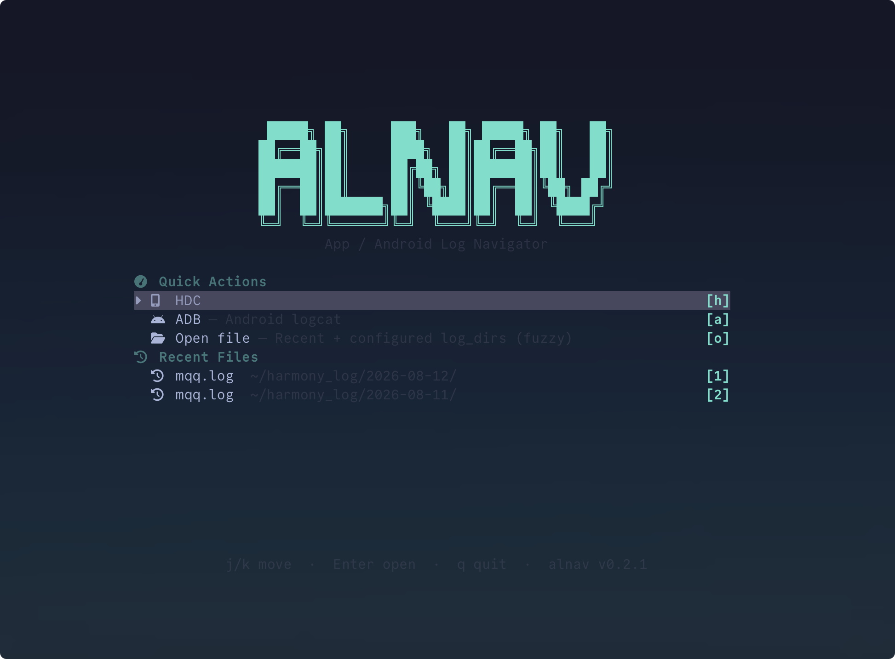
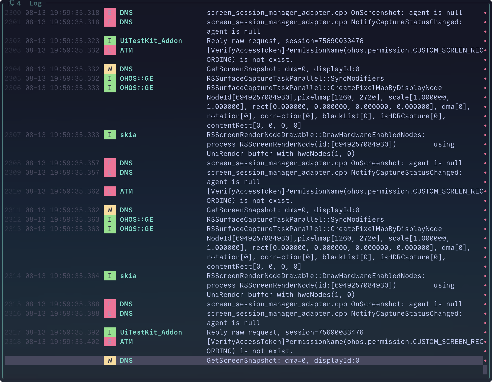

<p align="center">
  
</p>

<p align="center">
  <strong>English</strong> · <a href="./README.zh.md">中文</a>
</p>

<p align="center">
  <a href="https://crates.io/crates/alnav"></a>
  <a href="https://crates.io/crates/alnav"></a>
  <a href="https://github.com/Rossettaylm/alnav/blob/master/LICENSE"></a>
  <a href="https://github.com/Rossettaylm/alnav"></a>
</p>

**alnav** (App / Android Log Navigator) is a terminal tool for Android logcat, xlog, and HarmonyOS hilog. It opens a vim-style TUI by default; scripts and agents use `alnav grep` for structured filter, crash, and summary output.

<table>
  <tr>
    <td align="center" valign="top" width="50%">
      
      <br>
      <sub>Dashboard</sub>
    </td>
    <td align="center" valign="top" width="50%">
      
      <br>
      <sub>Log list</sub>
    </td>
  </tr>
</table>

## Install

```bash
cargo install alnav

alnav -f app.log                 # TUI
alnav grep -f app.log --level E  # CLI
```

<details>
<summary>From source</summary>

```bash
git clone https://github.com/Rossettaylm/alnav
cd alnav
cargo install --path alnav
```
</details>

Config directory: `--config-path` > `$ALNAV_HOME` > `~/.config/alnav/`.

## Themes

Nine TUI palettes. Set `theme` in `config.toml` and **restart**. The Dashboard wordmark, chrome, and log colors follow the theme. `alnav grep` CLI colors are unchanged.

```toml
# ~/.config/alnav/config.toml
theme = "kanagawa"
```

| `theme` | Accent | Aliases |
|:--------|:-------|:--------|
| `default` | cyan, no canvas paint | `builtin` |
| `onedark` | blue | `one-dark` |
| `dracula` | magenta | |
| `everforest` | green | |
| `tokyo-night` | blue | `TokyoNight` |
| `catppuccin-mocha` | magenta | `catppuccin` / `mocha` |
| `gruvbox-dark` | yellow | `gruvbox` |
| `nord` | cyan | |
| `kanagawa` | blue | `kanagawa-wave` |

Optional overlay: copy [`alnav/examples/theme.toml`](alnav/examples/theme.toml) to `~/.config/alnav/theme.toml`. `[palette]` merges into the 18 ANSI slots first; other keys override semantic tokens (`accent`, selection washes, 8-slot `highlight`). `highlight` must have exactly 8 entries or the whole overlay is discarded.

## Usage

```bash
alnav -f app.log
alnav --adb
alnav --hdc --device <serial>

adb logcat | alnav grep --tag "OkHttp" --level W
alnav grep -f app.log --summary
alnav grep -f app.log --crashes
alnav grep --help
```

In the TUI, `yc` exports the current filter as one `alnav grep …` command.

## Why not grep

One `alnav grep` usually replaces several `grep` / `rg` passes plus ad-hoc stats:

| | alnav | grep / rg |
|:--|:------|:----------|
| Formats | hilog / xlog / threadtime / brief | raw text |
| Level | `--level W` → W/E/F | regex |
| Boolean | `-e '(tag ~ A or tag ~ B) and level >= W'` | pipelines |
| Aggregate | `--summary` / `--histogram` / `--dedupe` | DIY |
| Crashes | `--crashes` structured output | DIY |
| Output | `--fields` / `--limit` / JSON · CSV | whole line |

Android / HarmonyOS device logs only. Use `rg` for general text.

## CLI

```bash
alnav grep -f app.log --tag "OkHttp" --msg "timeout" --level W
alnav grep -f app.log -e '(tag ~ OkHttp or tag ~ Retrofit) and level >= W'
alnav grep -f app.log --since 10:30:00 --until 10:35:00
alnav grep -f app.log --format json --fields timestamp,level,tag,msg --limit 50
alnav grep --adb --device <serial> --level E
```

Same-field flags OR; `--and` makes them AND. Cross-field is AND. `--level W` matches W/E/F. Multiple `-e` are OR.

`--adb` and `--hdc` are mutually exclusive and cannot combine with `-f`, `--time-context`, `--follow-pid`/`--follow-tid`, or `--sort-time`.

## Log formats

| Format | Example |
|:-------|:--------|
| **hilog** | `04-16 11:52:56.297 11114 11114 I A00201/com.tencent.mqq/QRouter: msg` |
| **xlog** | `2026-03-04 10:23:28.872\|1[3542]3831\|3542\|I\|NTKernel\|msg` |
| **threadtime** | `03-04 10:23:28.872  3542  3831 I NTKernel: msg` |
| **brief** | `I/NTKernel(3542): msg` |

[MIT](LICENSE)
