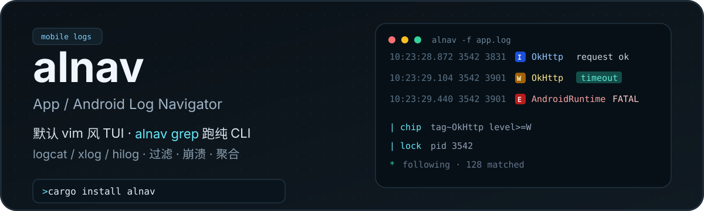

<p align="center">
  
</p>

<p align="center">
  <a href="https://crates.io/crates/alnav"></a>
  <a href="https://crates.io/crates/alnav"></a>
  <a href="#license"></a>
  <a href="https://github.com/Rossettaylm/alnav"></a>
</p>

**alnav**（App / Android Log Navigator）是面向 Android logcat、xlog、HarmonyOS hilog 的终端日志工具：默认打开 vim 风格 TUI，脚本与 AI agent 用 `alnav grep` 做结构化过滤与聚合。

<p align="center">
  
</p>

## 安装

```bash
cargo install alnav
```

```bash
# 第一次成功路径
alnav -f app.log                 # TUI
alnav grep -f app.log --level E  # CLI
```

<details>
<summary>从源码安装</summary>

```bash
git clone https://github.com/Rossettaylm/alnav
cd alnav
cargo install --path alnav
```
</details>

本版本仍附带兼容别名（**下一版本移除**）：`aloggrep` / `alg` ≡ `alnav grep`，`aloggrep-tui` ≡ `alnav`。

配置硬切：`--config-path` > `$ALNAV_HOME` > `~/.config/alnav/`。旧目录请手动迁移：`~/.config/aloggrep` → `~/.config/alnav`。

## TUI 主题

TUI 九套内置配色，写在 `config.toml` 后**重启**生效。Dashboard 字标、边框、日志级别色都跟主题走；`alnav grep` CLI 颜色不变。

```toml
# ~/.config/alnav/config.toml
theme = "kanagawa"
```

| `theme` | 签名色 | 别名 |
|:--------|:-------|:-----|
| `default` | 青，不涂画布 | `builtin` |
| `onedark` | 蓝 | `one-dark` |
| `dracula` | 品红 | |
| `everforest` | 绿 | |
| `tokyo-night` | 蓝 | `TokyoNight` |
| `catppuccin-mocha` | 品红 | `catppuccin` / `mocha` |
| `gruvbox-dark` | 黄 | `gruvbox` |
| `nord` | 青 | |
| `kanagawa` | 蓝 | `kanagawa-wave` |

可选 overlay：复制 [`alnav/examples/theme.toml`](alnav/examples/theme.toml) 到 `~/.config/alnav/theme.toml`。`[palette]` 先改 ANSI 18 槽再映射；其余键覆盖语义色（`accent`、选中底、8 档 `highlight` 等）。`highlight` 必须正好 8 项，解析失败则整份丢弃并回退。完整字段见该模板。

## 快速上手

```bash
# TUI：文件 / 实时设备
alnav -f app.log
alnav --adb
alnav --hdc --device <serial>

# CLI：管道与分析
adb logcat | alnav grep --tag "OkHttp" --level W
alnav grep --adb --tag "OkHttp" --level W
alnav grep -f app.log --summary
alnav grep -f app.log --crashes
alnav grep --help
alnav grep --example
```

TUI 内 `yc` 可将当前过滤导出为一行 `alnav grep …`。

## 为什么不只用 grep

一条 `alnav grep` 通常能替代 agent 多轮 `grep` + 自行统计：

| 能力 | alnav | grep / rg |
|:-----|:------|:----------|
| 格式感知 | hilog / xlog / threadtime / brief 自动解析 | 纯文本 |
| 语义级别 | `--level W` → W/E/F | 手写正则 |
| 布尔过滤 | `-e '(tag ~ A or tag ~ B) and level >= W'` | 多管道 |
| 聚合 | `--summary` / `--histogram` / `--dedupe` | 自行算 |
| 崩溃 | `--crashes` 结构化输出 | 手写识别 |
| 输出控制 | `--fields` / `--limit` / JSON·CSV | 整行文本 |

> 适用范围仅限 Android / HarmonyOS 设备日志；通用文本请继续用 `rg`。

## CLI 要点

```bash
# 多条件：同类 OR，跨类 AND；加 --and 改同类 AND
alnav grep -f app.log --tag "OkHttp" --msg "timeout" --level W
alnav grep -f app.log --tag A --tag B --and

# 表达式
alnav grep -f app.log -e 'msg ~ timeout and tag ~ OkHttp'
alnav grep -f app.log -e '(tag ~ OkHttp or tag ~ Retrofit) and level >= W'

# 时间 / 输出 / 分析
alnav grep -f app.log --since 10:30:00 --until 10:35:00
alnav grep -f app.log --format json --fields timestamp,level,tag,msg --limit 50
alnav grep -f app.log --histogram 1m
alnav grep -f app.log -M --tag AndroidRuntime   # 合并堆栈
alnav grep -f 'logs/*.log' --sort-time --level E
```

| 过滤规则 | 行为 |
|:---------|:-----|
| `--tag A --tag B` | OR |
| `--tag A --tag B --and` | AND |
| `--tag A --msg err` | 跨字段 AND |
| `--level W` | W / E / F |
| `-e E1 -e E2` | 表达式之间 OR，与其他 flag AND |

### Live：`--adb` / `--hdc`

```bash
alnav grep --adb --device <serial> --level E
alnav grep --hdc --tag AppFreeze
```

启动时查询设备时间并跳过更早缓冲；二者互斥，且不可与 `-f`、`--time-context`、`--follow-pid`/`--follow-tid`、`--sort-time` 同用。

## 支持的日志格式

| 格式 | 示例 |
|:-----|:-----|
| **hilog** | `04-16 11:52:56.297 11114 11114 I A00201/com.tencent.mqq/QRouter: msg` |
| **xlog** | `2026-03-04 10:23:28.872\|1[3542]3831\|3542\|I\|NTKernel\|msg` |
| **threadtime** | `03-04 10:23:28.872  3542  3831 I NTKernel: msg` |
| **brief** | `I/NTKernel(3542): msg` |

## Claude Code Skill

仓库附带 `loggrep-analyzer.skill`，可让 agent 按「概览 → 定位 → 追踪 → 报告」分析日志：

```bash
unzip loggrep-analyzer.skill -d ~/.claude/skills/loggrep-analyzer
```

## 架构（简）

```
alnav-core/   # lib name = alnav：解析 / 过滤 / 格式化
alnav/        # 统一二进制：alnav · alnav grep · 兼容别名
```

```
stdin/file/adb/hdc → [MultilineMerger] → LogEntry::parse()
  → FilterChain → [CrashDetector] → Formatter / Summary
```

## 退出码（CLI）

| 码 | 含义 |
|:---|:-----|
| `0` | 有匹配 |
| `1` | 无匹配 |
| `2` | 参数错误 |

## License

[MIT](LICENSE)
